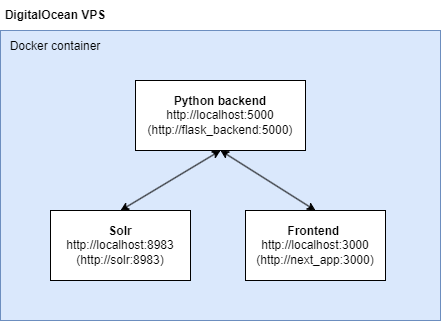

# European universities full text search

## Participants

| Name            | Email                |
| --------------- | -------------------- |
| Ilina Kirovska  | up202301450@fe.up.pt |
| Goncalo Almeida | up202308629@fe.up.pt |
| Žan Žlender     | up202302230@fe.up.pt |

## Getting started

### Milestone 1

The main file of the project is located in `/scripts/main.ipynb`.

The recommended way to open it is inside of Visual Studio Code with the Python and Jupyter extensions installed.

### Milestone 2

Position into folder `milestone_2` and execute the `startup.sh` script. With Bash installed the command is just `./startup.sh`.

This will guide you to running Solr.

Once done you can view it on [http://localhost:8983](http://localhost:8983).

### Milestone 3

Follow the steps defined in [Milestone 2](#milestone-2) and then follow the steps as described in `app/README.md`.

### Final webapp

The final result is a web application - search engine - that enables the user to search for any european university by typing whatever they are interested in.

#### Architecture

The simplified architecture of our service looks like so:

#### Run locally

To run the final app follow these steps:

1. position into `app/` directory
2. execute command `docker compose up -d`
3. after all containers are running go to [http://localhost:8983/solr](http://localhost:8983/solr) select the universities core and check if documents were uploaded
   1. if 519 documents are shown go to 4.
   2. if no documents are shown, run `docker compose up -d --build solr_setup` or restart the `solr_setup` container which will upload all documents
4. Open [http://localhost:3000](http://localhost:3000) and start using the app

#### Apply changes

If you need to apply changes to any of the running containers, e.g. changes in the code, follow these steps:

1. run `docker compose down -v`
2. then `docker compose up -d --build`
3. follow steps 3 and after as described in [Run locally](#run-locally)

#### Remote access

The final webapp is deployed on DigitalOcean, accesible on this link: [https://TODO_ADD_LINK.com](https://TODO_ADD_LINK.com).
